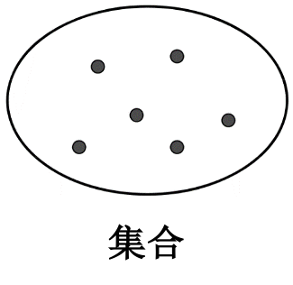
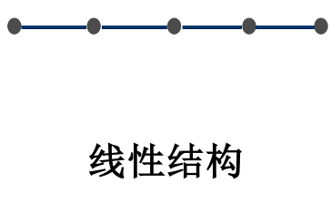
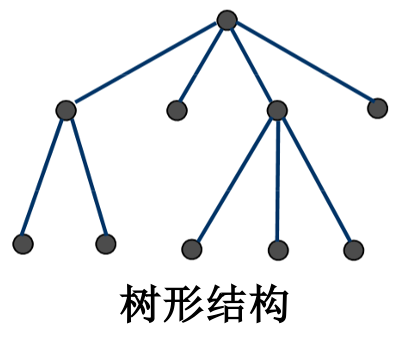
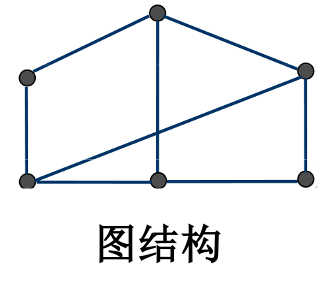

# 数据结构与算法

## 0 basic

### 0.1 关于笔记

笔记出于某985跨校区人工智能实验班的数据结构与算法课 & 清华CPP版数据结构 & 数据结构与算法 等教材。班级课程不需要和其他班级对齐，学生也没有考研需求，所以但从应试角度可能笔记稍有出入。

### 0.2 绪论

1946年，ENIAC问世后计算机科学computer science也随之诞生。计算机科学的核心在于研究计算方法与过程的规律（不只是作为计算工具的计算机本身），所以E.Dijkstra及其追随者更倾向于将这门科学称为计算科学Computing science。

Donald. E. Knuth的经典著作The Art of Computing Programming（让他37岁获得图灵奖，没错，写书写出图灵奖）提出Computer Science是研究`信息表示`和`信息处理`的科学，信息在计算机内部通过数据表示，并引领了数据结构的兴起。后来Niklaus Wirth（图灵奖得主，Pascal之父）在1976年出版了Algorithm + Data Structure = Programs一书。

- 程序设计
  - 数据结构（问题的数学模型）和算法（处理问题的策略）
  - 数据表示：存储数据的方案
  - 数据处理：处理数据，进行求解

数据结构本身也在不断发展，无结构阶段在简单数据上做复杂运算、结构化阶段则提出数据结构+算法=程序

计算机求解问题时，先抽象出问题的模型，再求解。数值问题建立数学方程、非数值问题寻找数据结构

- 数据结构探讨的问题
  - 逻辑结构：数据元素之间的逻辑关系，是具体关系的抽象
  - 存储结构（物理结构）：数据元素及其关系再计算机内存中的表示
  - 数据运算：对数据施加的操作。定义在数据的逻辑结构上的抽象的操作

总结：数据结构是一门讨论“描述现实世界实体的数学模型 (非数值计算) 及其上的操作在计算机中如何表示和实现”的学科。

### 0.3 基本术语

#### 数据类型、数据结构和ADT

- 数据
  - 一切能输入到计算机中，并且能被计算机程序识别和处理的符号集合
  - 分为`数值数据`(整数、实数等)和`非数值数据`(图像、图形、文字和声音等)（注，文字也是非数值结构）
- 数据元素
  - 数据的基本单位，在计算机程序中通常作为 一个整体进行考虑和处理
  - 结点：数据元素在计算机内的位串表示
- 数据项
  - 构成数据元素的最小单位
  - 域/字段：数据元素中数据项在计算机内的表示
- 数据对象
  - 具有相同性质数据元素的集合
  - 信息表：是数据对象在计算机内的表示

即：项->元素->对象；字段->结点->表。准确讲，数据的主要单元是数据元素，这是平时说的对象；称其最基本组成部分为数据项，也就是字段；把数据元素再组成集合，就是数据对象，他是数据元素的整体。

- 数据结构
  - 数据元素之间的相互关系，这种关系是抽象的，即并不涉及数据元素的具体内容
  - 是数据元素及其相互间关系的数学描述
  - 相互之间存在一定关系的数据元素的集合
  - 按照视角的不同，数据结构分为逻辑结构和存储结构  
    - 逻辑结构是数据元素之间的抽象关系，数据元素之间逻辑关系的整体，是从具体问题抽象出来的数据模型；
    - 存储结构是数据及其逻辑结构在计算机中的表示，也叫物理结构，实质上是内存分配，以确定元素及元素之间关系的表示。在具体实现时，依赖于计算机语言；

定义：数据的逻辑结构是个二元组，即Data_structure = (D, R)，其中D是数据元素的有限集、R是D上关系的有限集

定义四种基本的数据结构：集合、线性结构、树形结构、图结构

  
  

从逻辑结构类型上看，
线性结构：除第一个元素和最后一个元素之外，其他元素都有且仅有一个直接前驱，有且仅有一个直接后继；
非线性结构：其逻辑特征是一个结点可能有多个直接前驱和直接后继；

eg. 线性表、栈、队列、串、数组、广义表都是线性结构；集合、树、图都是非线性结构。

从存储结构来看
基本的：
顺序存储结构：结构用一组连续的存储单元依次存储数据元素，数据元素之间的逻辑关系由元素的存储位置来表示
链接存储结构用一组任意的存储单元存储数据元素，数据元素之间的逻辑关系用指针来表示（互相指向）
进一步：
索引存储方法
散列存储方法

- 逻辑结构与存储结构的关系
  - 数据的逻辑结构属于`用户视图`，是面向问题的，反映了数据内部的构成方式；
  - 数据的存储结构属于`具体实现`的视图，是面向计算机的
  - 总结：一种数据的逻辑结构可以用多种存储结构来存储，而采用不同的存储结构，其数据处理的效率往往是不同的

抽象数据类型AbstractDataType，即ADT。指一个数学模型和在该模型上定义的操作集合的总称（也就是说包括数据操作）。
例如，$$ADT\space int = (\{𝒙|𝒙∈𝒁\}，\{+,−, ∗, /, \%, ≤,==\}  )$$
同一数学模型上定义不同的操作集，则它们代表不同的 ADT.用适当的数据结构来表示ADT中的数学模型，并用一组函数（方法）来实现该模型上的各种操作

之前我们提过，数据结构是一个二元组，是(D, R)二元组。其中D是数据元素的有限集，R是关系的有限集。通俗来讲，就是待处理对象和他们的关系（注意这个不是数据对象，数据对象是数据元素的集合）。类似的，ADT = (D, S, P)，也就是D 是数据对象;  S 是 D 上的关系集;  P 是 D 的基本操作集。（注意，数据结构里的是数据元素，也就是基本元素、ADT里的是数据对象，也就是数据元素的集合）。换言之，ADT是抽象出的针对所有这样的数据元素的概念（毕竟是一种数据类型嘛）。

抽象数据类型具有：

- 完整性：反映所定义的抽象数据型的全部特征
- 统一性：前后协调，不自相矛盾
- 通用性：适用于尽量广泛的对象
- 不依赖性：不依赖于程序设计语言

辨析一下

- 数据类型是一组值的集合
- 数据结构则是数据元素之间的抽象关系
- ADT是一个数学模型及在该模型上定义的操作集的总称
- 数据类型是根据数据结构分类的，同类型的数据元素的数据结构相同
- 数据结构则是ADT中数学模型的表示、ADT是数据类型的进一步推广和进一步抽象

#### 算法

##### 性质上讲

算法是对问题求解过程的一种描述，根据输入的input，通过一个明确的确定的、有限长的操作序列，给出一个合适的output。

- 输入与输出
  - 需要为`指令序列`提供待处理对象，称为input输入
  - `指令序列`给出处理后的结果，也就是output输出
- 基本操作、确定性、可行性
  - 算法应当可以被描述为若干明确的基本操作的指令序列
- 有穷性与正确性
- 退化与鲁棒性
  - 同一问题往往不局限于一种算法，同意算法也常常会有多种实现方式。因此最好从使用角度对不同算法及其不同版本做出细致考量和取舍（尽管一定程度上，这个点主要是软件工程要做的问题）
  - 好的算法最好能面对各种复杂的、意料之外的情况
- 重用性
  - 好的算法应当能更便捷地推广到更多应用场合，有更好的普遍适用性

算法需要满足五个最基本的性质：

- 有穷性：算法中的操作步骤为有限个，且每个步骤都能在有限时间内完成（要是一直运转死循环就解决不了问题了）
- 确定性：组成算法的操作必须清晰无二义性
- 可行性：算法中的所有操作都必须足够基本，都可以通过已经实现的基本操作运算有限次实现之
- 输入：作为算法加工对象的量值，通常体现为算法中的一组变量。某些算法的字面上可以没有输入，实际上已被嵌入算法之中
- 输出：它是一组与输入有确定关系的量值，是算法进行信息加工后得到的结果，这种确定关系即为算法的功能

算法还应该：

- 正确性：给出真正想要的output（不能设计输入什么都说`那咋了`的算法）
- 健壮性：能尽量好地应对非法输入的数据作出恰当反映或进行相应处理
- 高效性：应考虑所设计的算法具有“高效率与低存储量”（能简则简，不要大炮打蚊子）
- 可读行：在满足前面算法的性质下，需增强算法的可读性

对于算法而言，还有一些更深奥的问题：

- 可计算性
  - 上面的要求都很容易理解，如果能写出那样的算法就很完美了。遗憾的是，很多问题其实很难满足上面的内容，甚至实践过程中，很多过程根本就不可能设计出必然终止的算法
  - 有专门的理论研究问题的算法可解性，称为可计算性computability
- 难解性
  - 有的问题即使可以给出一个还算说得过去的算法，但也很难实用：比如时间复杂度极高、空间复杂度极高
  - 也有专门的理论，难解性问题intractability
- 计算效率
  - 在程序合法的情况下，排除不可解或者难解的问题，我们想要程序的计算效率尽可能高，处理尽可能大规模的数据，这也是当前咱们课程最在意的事情
- 数据结构
  - 数据结构正是以数据的表现形式为研究对象，也是这门课程的要义

评价算法可以有：

- 事后统计：将算法实现，测算其时间和空间开销
- 事前分析：对算法所消耗资源的一种估算方法

算法分析：

先定义：

- 问题规模：输入量的多少
- 基本语句：是执行次数与整个算法的执行次数成正比的操作指令

- 时间复杂度：Time Complexity
  - 是基本（操作）语句重复执行的次数，它是问题规模的一个函数。我们把这个函数的渐近阶称为该算法的时间复杂度。
  - 实际估计过程中，计算机硬件配置高低、电脑装的操作系统、写代码用的语言…这些都会影响程序的运行快慢，但是都关于计算机软件和硬件而不是算法本身，所以都不考虑。最主要还是看`问题的规模大小`和`算法选用的策略`这两条性质
  - 定义大O符号(表示渐进复杂度，也就是时间复杂度)：`存在两个正的常数 𝒄 和 𝒏𝟎，对于任意 𝒏≥𝒏𝟎，都有𝑻(𝒏 )≤ 𝒄×𝒇(𝒏)，则称 𝑻(𝒏)=𝑶(𝒇(𝒏))`
    - 注：可以看到这里关注的更多是大规模输入的情况下，所以关注数量级，所以常数倍不重要，c*f(n)的c直接忽略了；
    - 这很容易理解，因为数据规模小的时候算法好不好都没太大差别，没啥研究意义。
    - 而且关注的时候，是从n0开始，换句话来说，`有限的点`之前的都不重要。
    - 也就是`当问题规模充分大时在渐近意义下的阶`
    - 渐近复杂度的核心在于用渐近上界估计时间复杂度。
    - th：若$𝑨(𝒏)=𝒂_𝒎𝒏^𝒎+𝒂_{(𝒎−𝟏)} 𝒏^{(𝒎−𝟏)}+…+𝒂_𝟏𝒏+𝒂_𝟎是一个𝒎次多项式，则 𝑨(𝒏)=𝑶(𝒏^𝒎)。$也就是说在计算算法时间复杂度时，可以忽略所有低次幂（低阶）项 和高次幂（高阶）项的系数
    - 运算法则（设$𝑻_𝟏 (𝒏)=𝑶(𝒇(𝒏)), 𝑻_𝟐 (𝒏)=𝑶(𝒈(𝒏))$）
      - 加法法则：$𝑻_𝟏 (𝒏)+𝑻_𝟐 (𝒏)=𝑶(𝒎𝒂𝒙\{𝒇(𝒏), 𝒈(𝒏)\})$
      - 乘法法则：$𝑻_𝟏 (𝒏)∗𝑻_𝟐 (𝒏)=𝑶(𝒇(𝒏)∗𝒈(𝒏))$
    - 常见语句
      - 赋值语句或读/写语句：运行时间通常取O(1)。有函数调用的除外，此时要考虑函数的执行时间（也就是说认为是常数量级）
      - 语句序列：运行时间由加法规则确定，即该序列中耗时最多的语句的运行时间
      - 分支语句：运行时间由条件测试 (通常为O(1)) 加上分支中运行时间最长的语句的运行时间
      - 循环语句：是对输入数据重复执行n次循环体所耗时间的总和；通常将常数因子忽略不计，可以认为上述时间是循环重复次数n和m的乘积，其中m是n次执行循环体当中时间消耗多的那一次的运行时间 (乘法规则) 。
      - 函数调用语句：
        - 若程序中只有非递归调用，则从没有函数调用的被调函数开始，计算所有这种函数的运行时间
        - 若程序中有递归调用，则令每个递归函数对应于一个未知的时间开销函数T(n)，其中n是该函数参数的大小，之后列出关于T的递归方程并求解之
- 空间复杂度：Space Complexity
  - 算法的空间开销与输入的规模、表示方式、算法采用的数据结构、算法的设计以及输入数据的性质有关
  - 算法的执行的不同时刻，其空间开销很可能是不同的，算法的空间复杂度是指算法在执行过程中的最大存储量需求

常见的阶：$$𝑶(𝟏)<𝑶(𝐥𝐨𝐠_{𝟐⁡}n)<𝑶(𝒏)<𝑶(𝒏 𝒍𝒐𝒈_𝟐⁡𝒏 )<𝑶(𝒏^𝟐 )<𝑶(𝒏^𝟑 )<…<𝑶(𝟐^𝒏 )<𝑶(𝒏!)$$

这里的数量级上：

$$
log⁡𝑛=lg⁡𝑛=log_2⁡𝑛\newline
ln⁡𝑛=log_𝑒⁡𝑛\newline
⌊𝑥⌋ 表示小于等于𝑥的最大整数 (下取整)\newline
⌈𝑥⌉ 表示大于等于𝑥的最小整数 (上取整)\newline
$$

理解：可以注意到，其实对数函数相当于同一数量级，用换底公式就可以证明。

函数有界性：

函数的有界性
$$
设函数𝑓(𝑥)的定义域 𝐷，数集 𝑋⊂𝐷，\newline
如果存在数𝐾_1，对任意𝑥∈𝑋，都有𝑓(𝑥)≤𝐾_1，则称函数 𝑓(𝑥) 在𝑋上有上界𝐾_1；\newline
如果存在数𝐾_2，对任意𝑥∈𝑋，都有𝑓(𝑥)≥𝐾_2，则称函数 𝑓(𝑥) 在𝑋上有下界𝐾_2。\newline
$$

我们分类出：

> P问题 (Polynomial): 多项式时间可解的问题
> NP问题 (Non-Deterministic Polynomial)：多项式时间内不能求解的问题
> 本科目不会深入涉及P和NP问题。
> 多项式时间：𝑂(𝑛), 𝑂(log⁡𝑛), 𝑂(𝑛^𝑐) 非多项式时间：𝑂(2^𝑛), 𝑂(𝑛!)

算法增长的阶也称为增长率，增长量级或时间复杂度（time complexity）(可以注意到，主要在看时间复杂度)，只与输入问题的规模𝒏相关。如果它的运算时间随着输入规模的增长比另一个算法增长的慢，我们称一个算法比另一个算法“效率高”。比方说我们用 $𝜣(𝒏^𝟐) $表示插入排序的最坏运行时间，不是说他的运行时间是$𝒏^𝟐$，而是增长率与$𝒏^𝟐$相同

能夹逼住，就叫同阶。

通常来说，一个渐近正函数的低阶项在确定渐近确界时可以被忽略
比如比如$f(n) = an^2+bn+c=\Theta{(n^2)},其中a,b,c是常数且a>0；$
又如$p(n) = \Sigma_{i=0}^da_in^i=\Theta(n^d), 其中a_i是常数且a_d>0$

注意，同阶在意的是阶数，而不是单纯的大小。所以其实看上去更小的函数或者更大的函数也可以是同阶的，具体夹逼过程交给前面的常数c来搞定。

##### 更多表示符号

需要注意，这里的符号表示的都是对应的函数集合

- $\Theta$
  - 同阶函数集合
  - $\Theta(𝒈(𝒏))=\{𝒇(𝒏)∣\exist𝒄_𝟏,𝒄_𝟐>𝟎和𝒏_𝟎,对于∀𝒏\geq𝒏_𝟎, 𝒄_𝟏 𝒈(𝒏)\leq𝒇(𝒏)\leq𝒄_𝟐 𝒈(𝒏)\}$
  - 习题：证明$f(x) = \Theta{(g(x))}$，相当于解$ 𝒄_𝟏 𝒈(𝒏)\leq𝒇(𝒏)\leq𝒄_𝟐 𝒈(𝒏)$中的$c_1$和$c_2$。对于多项式函数来说，直接约分是来的最快的。
- $O$
  - 低阶函数集合
  - $O (𝒈(𝒏))=\{𝒇(𝒏)|\exist𝒄>𝟎和n_𝟎,对于∀𝒏≥𝒏_𝟎,𝟎\leq𝒇(𝒏)\leq𝒄𝒈(𝒏)\}，$
  - 这里在乎的也是阶数
  - O(n)找到的是渐进上界
  - 需要注意，$\Theta标记强于O标记，f(n) = \Theta(f(x))\Rightarrow f(n) = O(f(x))$
    - 不难理解，如果是同阶，就可以通过更大的常数倍数成为其上界
- $\Omega$
  - 高阶函数集合
  - $𝛀(𝒈(𝒏))=\{𝒇(𝒏)|\exist 𝒄>𝟎"和" 𝒏_𝟎,"对于"∀𝒏≥𝒏_𝟎,𝟎≤𝒄𝒈(𝒏)≤𝒇(𝒏)\}$
  - 若f(n)是g(n)的高阶函数，就可以说cg(n)可以找到f(n)的渐进下界
- $o$
  - 严格低阶函数集合
- $\omega$
  - 严格高阶函数集合

我们用$f(x)\in X(g(x)), X =O,o,\Omega,\omega,\Theta$的形式讨论。先约定，这里的属于$\in$为了方便可以写成`=`这里说的都是f(x)是g(x)的对应项，例如f(x)是g(x)的高阶表示f(x)是高阶，相当于在用g(x)给f(x)找渐进下界。

- 五个标记都有传递性
- 除了$o,\omega$两个严格标记剩下三个标记都有自反性（如$f(x) = \Theta(f(x))$
- $\Theta$有对称性，也就是$f(x) = \Theta(g(x))\Leftrightarrow g(x) = \Theta(f(x))$
- 反对称性：f(x)是g(x)的(严格)高阶函数$\Leftrightarrow$ g(x)是f(x)的(严格)低阶函数

并非所有的函数都是可比的。

总结：O族低阶找上界，$\Omega$族高阶找下界, $\Theta$刚好找紧界。

所以，O族记号找到上界，是找出最坏情况；$\sigma$族找到下界，是估计最好情况。术语分别为worst case和best case。

### 0.4 算法分析

#### 和式的估计

线性性质：

- $∑_{(𝑘=1)}^𝑛(𝑐𝑎_𝑘+𝑏_𝑘 ) =𝑐∑_{(𝑘=1)}^𝑛𝑎_𝑘 +∑_{(𝑘=1)}^𝑛𝑏_𝑘$
- ∑_{(𝑘=1)}^𝑛Θ(𝑓(𝑘)) =Θ(∑_{(𝑘=1)}^𝑛𝑓(𝑘)):也就是低阶函数加起来仍然是低阶

### 0.4 一点实例练习

#### 常数阶时间复杂度

代码：

```c
// chapter1 eg1.c
#include <stdio.h>

int main(void) {
    int end = 100;
    int result = (1+end)*end/2;
    printf("The sum equals to %d.\n", result);
    return 0;
}
```

无论输入是多少，都是直接代入公式，认为这种语句都是常数阶的时间复杂度，也就是O(1)。

#### 线性阶时间复杂度

```c
// chapter1 eg2.c
#include <stdio.h>

int main(void) {
    int result = 0;
    for (int i=1; i<=100; i++) result += i;
    printf("The sum equals to %d.\n", result);
    return 0;
}
```

这个时间复杂度就要明显变大了，因为这里的for循环会随着数据规模增大而循环越来越多次，每次得到c * n的时间消耗，c是for-loop的循环体内的代码的时间复杂度。考虑到这里循环体内部是常数，所以这里得到的结果也就是O(n)。

#### 对数阶时间复杂度

```c
// chapter1 eg3.c
#include <stdio.h>

int main(void) {
    int start, time, end;
    end = 1024;
    start = 1;
    for (time = 0; start != end; start*=2) time++;
    printf("%d equals to the %d power of 2.\n", end, time);
    return 0;
}
```

用这个算法可以得出1024是2的10次幂。这个算法在用指数的速度逼近，所以时间复杂度其实在看有多少个2，很显然，这个时间复杂度是$log_2n$，或者说$ln n, lg n$都是一样的。用对数换底公式分离出常数底就可以。

#### 平方阶时间复杂度

```c
// chapter1 eg4.c
#include <stdio.h>

int main() {
    int n;
    printf("Type in number n: ");
    scanf("%d", &n);

    int count = 0;

    // 双重循环，时间复杂度 O(n^2)
    for (int i = 0; i < n; i++) {
        for (int j = 0; j < n; j++) {
            count++;
        }
    }

    printf("Total operation time: %d\n", count);
    return 0;
}
```

这里也很容易理解，count++是表达式语句，视为O(1)，一个for-loop是一个线性阶，乘n；再乘n得到$n^2$，也就很自然得出，这里的时间复杂度是$O(n^2)$。

## 1 vector

### 1.1 从数组到向量

#### Abstract Data Type vs. Data Structure

- 抽象数据类型 = 数据模型 + 定义在数据模型上的操作
- 数据结构 = 给予某种语言，实际上实现ADT的一整套算法

> ADT是抽象，data structure是实现

Application = Interface X Implementation

按照ADT规范,高层算法设计者可与底层数据结构实现者高效地分工协作,每种操作接口只需统一地实现一次代码篇幅缩短，安全性加强，软件复用度提高.

#### 数组array

`数据结构是数据项的结构化集合`（从最基本item角度考虑，也就是对应数据元素这一层次），其结构性表现为数据项之间的相互联系及其作用，也可以理解为定义于数据项之间的某种逻辑次序。根据这种逻辑次序的复杂程度，大致可以将各种数据结构分成线性结构、半线性结构和非线性结构三大类。在线性结构中，各数据项按照一个线性次序构成一个整体。最为基本的线性结构统称为`序列`（sequence）。

我们记得数据结构分为逻辑结构和物理结构或者说存储结构。在确认逻辑结构是按顺序线性排列后，我们讨论存储结构。如果各个数据项有序排列，和逻辑结构完美吻合，就称这种数据结构为`向量vector`，此时的逻辑顺序也叫`秩rank`；在`列表list`中，逻辑上相邻的数据项未必相邻，而是通过间接寻址的方式通过封装后的`位置position`相互连接引用。

众多语言的数组，自0开始，自n-1为止进行`索引indice`。对于任何$0\leq i < j < n$，A[i]都是A[j]的`前驱predecessor`，A[j]都是A[i]的`后继successor`。特别地，A[i-1]称为A[i]的`直接前驱(immediate predecessor)`，对于任何$i\leq n-2$， A[i+1]称为A[i]的`直接后继(immediate successor)`。任意元素的所有前驱称为其`前缀prefix`，所有后驱称为其`后缀suffix`。

采用这一套标准，可以让我们唯一确定每个元素的编号，并且在常数时间内完成对某一元素的访问、修改。具体地，若数组A[]存放空间的起始地址为A，且每个元素占用s个单位的空间，则元素A[i]对应的物理地址为A+s*i, 因其中元素的物理地址与其下标之间满足这种线性关系，故亦称作线性数组（linear array）

#### 向量vector : Call by rank

按照面向对象思想中的数据抽象原则，可对以上的数组结构做一般性推广(可以有更多对象作为其元素)，使其特性更有普遍性。向量（vector）就是线性数组的一种抽象与泛化，它也是由具有线性次序的一组元素构成的集合V = { v0, v1, ..., vn-1 }，其中的元素分别由秩相互区分。

各元素的秩（rank）互异，且均为\[0, n\)内的整数。具体地，若元素e的前驱元素共计r个,则其秩就是r。

以线性递归为例，运行过程中所出现过的所有递归实例，按照相互调用的关系可构成一个线性序列。在 此序列中，各递归实例的秩反映了它们各自被创建的时间先后，每一递归实例的秩等于早于它出现的实例总数；反过来，通过r亦可唯一确定$e = v_r$。这是向量特有的元素访问方式，称作“循秩访问”（call-by-rank）

经如此抽象之后，我们不再限定同一向量中的各元素都属于同一基本类型，它们本身可以是来自于更具一般性的某一类的对象。另外，各元素也不见得同时具有某一数值属性，故而并不保证它们之间能够相互比较大小。

##### 向量的ADT接口

作为一种抽象数据类型，向量对象应支持如下操作接口。

| 序号 | 操 作 接 口 | 功  能  | 适 用 对 象 |
|-------|------|------|------|
| 1     |   size()   |   报告向量当前的规模(元素总数)   |   向量   |
| 2     |   get(r)   |   获取秩为r的元素   |   向量   |
| 3     |   put(r, e)   |   用e替换原来位于r的元素   |   向量   |
| 4     |   insert(r, e)   |   将e放在秩为r的位置，原来的后继元素依次向后移动   |   向量   |
| 5     |   remove(r)   |   删除秩为r的元素，返回被删除的该元素   |   向量   |
| 6     |   disordered()   |   判断所有元素是否已按非降序排列   |   向量   |
| 7     |   sort()   |   调整各元素的位置，使之按非降序排列   |   向量   |
| 8     |   find(e)   |   查找目标元素e   |   向量   |
| 9     |   search(e)   |   查找e，返回不大于e且秩最大的元素   |   有序向量   |
| 10    |   deduplicate(), uniquify()   |   剔除重复元素   |   向量/有序向量   |
| 11    |   traverse()   |   遍历向量并统一处理所有元素   |   向量   |

## 2 list

### 2.0 线性表的ADT

最重要的一般是`GetItem, Insert, Delete`

### 2.1 线性表的逻辑结构

线性表是~~有线一样性质的表~~，其实应该说，是0或多个数据元素的有限序列。

首先他是一个序列，也就是说元素之间是有顺序的（除了第一个元素无前驱，最后一个元素无后继）。除了守卫元素，每个元素都有一个直接前驱和一个直接后继。另外，所有前面的元素都叫前驱，也就是前缀prefix，所有后面的元素都叫后继，也就是后缀suffix，尽管他们可能不直接。

称元素的个数为线性表的长度，当n=0的时候称为空表。在费控表中的每个数据元素都有一个确定的位置，如a1是一个数据元素，an是最后一个数据元素，ai是第i个元素，称i为数据元素ai在线性表中的位序。其实就相当于call by rank了，不过这里的序号是从1开始的，这个地方有必要注意一下。

### 2.2 线性表的顺序存储结构 & 线性表的链式存储结构

线性表的顺序存储结构（对应数组）

线性表的顺序存储，指的是用一段地址连续的存储单元依次存储线性表的数据元素。（上面的vector）优点在于无需为表示表中元素的逻辑关系而增加额外的存储空间，可以快速存取表中任意位置的元素；缺点在于插入和删除操作需要移动大量元素（例如，删除一个元素就需要把后面的元素大量往前调整）、当线性表长度变化较大时，难以确定存储空间的容量、也会造成存储空间的碎片。

线性表还有一种链式存储结构（对应链表）

使用结点node进行数据存储。一个结点包括存储的数据和指向直接后继元素的指针（这种叫做单链表）或数据、直接后继元素指针和直接前驱元素指针（这种叫做双链表）。在这里我们主要受双链表。

如果想要实现一个单链表，就需要一个指针指向第一个结点的存储位置，还需要最后一个结点的指针为空（通常使用NULL或者^符号表示）。当然，有时候为了更方便对链表进行操作，会在单链表的第一个节点前设一个头结点，数据域中不存储任何信息（也有的会附加正割线性表的长度等附加信息）。

P.S. 注意！这里说的头结点并不是第一个结点的意思，而是可选的表示一个单链表开始的结点。

- 头指针
  - 是指链表指向第一个结点的指针。如果有头结点的好想，就指向头结点
  - 头指针有标志性作用，所以经常头指针的名字冠以正割链表
  - 无论链表是否为空，头指针均不为空，是链表的必要元素
- 头结点
  - 为了操作的统一和方便而设立的
  - 放在第一元素结点之前，通常来说数据域无意义或者存储一些公共数据，比如链表长度
  - 有了头结点，对在第一元素节点潜插入节点和删除第一节点的操作就和普通节点一致了
  - 头结点不一定是必须的，这是可选的

### 2.3 线性表综述

整体上看，线性表的
